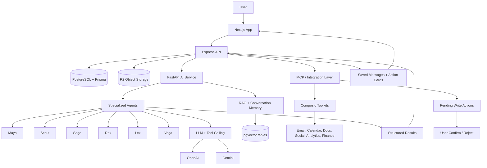

# Veqiro - AI Employees Platform

## 1. What I Built

Veqiro is an AI employees platform for founders and small teams. The product gives users a workspace where they can talk to specialized AI employees, give them tasks, connect outside tools, and receive structured work outputs instead of only chat replies.

The platform currently has six main AI employees: Maya for social content, Scout for market research, Sage for SEO, Rex for business analytics, Lex for legal and compliance work, and Vega for email and calendar assistance. Each agent has its own prompts, tools, UI forms, action cards, and backend routes.

What makes Veqiro different from a basic chatbot is that the agents are connected to product context, uploaded documents, long-term memory, typed workflows, and external tools. A user can ask for work like contract analysis, competitor research, SEO planning, content drafting, or inbox/calendar tasks, and the system can route the request through the right agent, retrieve context, call tools, stage write actions for approval, and render the result as a structured card in the product UI.

## 2. Problem

Small teams spend a lot of time on repetitive knowledge work: researching competitors, drafting posts, reviewing documents, preparing reports, checking metrics, writing emails, and collecting context from different tools.

These tasks are not always hard individually, but they require switching between documents, inboxes, analytics tools, spreadsheets, calendars, websites, and internal notes. A normal chatbot can help write text, but it usually does not know the user's workspace, cannot reliably fetch current context, and cannot safely execute real actions.

Veqiro tries to reduce that manual work by giving each task a specialized AI employee. The goal is not to replace judgment, but to handle the first pass: gather context, structure the task, use the right tools, produce a useful draft or analysis, and keep the human in control for sensitive actions.

## 3. How It Works

The main flow is:

User -> Next.js app -> Express backend -> FastAPI AI service -> agent prompt + memory + tools -> structured result -> saved message/action card

In the frontend, users interact with agent chats, forms, uploaded sources, integrations, dashboards, and result cards. The Next.js app calls the Express API.

The Express backend handles authentication, organization scope, database writes, billing/entitlements, message persistence, file upload finalization, integration state, and internal calls to the AI service. It also builds context for agent calls by loading recent chat history, organization memory, per-agent memory, connected integrations, and MCP tool metadata.

The FastAPI AI service owns the agent runtime. It builds the system prompt, retrieves semantic memories or RAG chunks where relevant, exposes native agent tools, adds connected MCP tools, calls the LLM, executes read tools, stages write tools for human approval, and returns the final message plus metadata for the UI.

## 4. AI Architecture

### Specialized agents

Veqiro implements six agents in `apps/ai/agents`: Maya, Scout, Sage, Rex, Lex, and Vega. Each agent extends a shared `BaseAgent`, but defines its own system prompt, domain rules, tool definitions, and tool execution logic.

### LLM providers and models

The AI service uses OpenAI for chat/tool calls and embeddings, and Gemini for vision, image generation, and video generation paths. The code includes `text-embedding-3-small` for embeddings, OpenAI chat models for agent reasoning, Gemini Flash for PDF/vision extraction, Gemini image generation for visual content, and a Gemini Omni video path for Maya video generation.

The repository contains mock-mode defaults for local development, so I would not claim a specific production model configuration from the repo alone.

### Tool calling

Agent tools are described with typed tool definitions and converted into provider-specific function/tool schemas. The shared agent loop supports multiple tool iterations, validates tool calls, executes tools concurrently, records tool traces, and returns structured action results for the frontend.

Native tools cover tasks like content drafting, market research, keyword research, financial analysis, contract analysis, document drafting, and compliance checks.

### RAG and embeddings

The AI service implements RAG using OpenAI embeddings and pgvector. Text is chunked, embedded, stored in Postgres vector columns, and retrieved by cosine similarity. Lex uses this for uploaded legal documents. Scout, Sage, Lex, and Rex also ingest important generated work back into RAG so future turns can reuse it.

### Memory and context

Veqiro has two memory layers:

- Semantic conversation memory in the AI service, stored in `conversation_memories` with pgvector embeddings.
- Application-level memory in Prisma models: `AgentMemory` and `OrgMemory`, storing running summaries, long-term facts, shared organization context, goals, decisions, and user preferences.

Before each agent call, the backend builds context from recent messages, summaries, long-term facts, organization memory, and relevant semantic memories.

### Integrations and MCP tools

The integration layer uses Composio-backed tools through a Node-controlled MCP bridge. The Python AI service never talks directly to Composio. It asks the Node backend for available tools and calls tools through internal REST endpoints. This keeps provider credentials and tenancy checks in the backend.

Read tools can execute during a turn. Write-capable tools are classified and staged as pending actions, so the user can confirm or reject them before the external action runs.

### Planned multi-step runs

The repo includes a planned run engine for multi-step tasks. The Node backend can ask the AI service to plan a DAG of steps, persist it as `AgentRun` and `AgentRunStep`, show it in the UI, and execute approved steps with dependency-aware scheduling. This is implemented as a guarded workflow and can fall back to the normal single-pass chat path.

### Structured outputs

Most agent actions return structured JSON. The frontend renders these into specific cards such as contract analysis cards, legal research cards, content drafts, SEO cards, Rex analytics cards, and document upload cards.

## 5. My Technical Contribution

The repository shows work across the frontend, Node backend, FastAPI AI service, Prisma schema, integrations, memory, and agent workflows. Git history also shows multiple contributors, so I would present my contribution as hands-on engineering work on the platform rather than claiming sole ownership of every feature.

The strongest technical contribution to highlight is building and integrating the AI employee workflow end to end:

- Implementing agent-specific backend routes and frontend action cards.
- Wiring chat requests through context building, memory, RAG, and tool execution.
- Designing database models for messages, memories, uploaded Lex sources, MCP connections, pending actions, and planned agent runs.
- Building document ingestion and legal analysis flows for Lex.
- Integrating external tools through a backend-controlled MCP/Composio layer.
- Adding safeguards for write actions through staged approval cards.
- Supporting streaming chat responses and persisted structured results.
- Debugging reliability issues around memory, tool traces, long tool results, model output parsing, and multi-step agent execution.

## 6. Important Technical Challenges

### Challenge: Making agents useful beyond plain chat

What was difficult?

A basic LLM response was not enough. Users needed durable results, cards, tool traces, files, and follow-up actions.

Approach:

The system uses structured agent tools, typed action IDs, saved message metadata, and dedicated frontend result cards. Tool calls return JSON that can be rendered as UI instead of only Markdown text.

Result:

Users can see outputs like contract risk breakdowns, SEO briefs, content drafts, document answers, and pending external actions in a clearer format.

### Challenge: Giving agents reliable context

What was difficult?

Agents needed to remember user preferences and previous work without flooding the model with the entire chat history.

Approach:

The backend combines recent messages, rolling summaries, long-term facts, organization memory, shared context, and semantic memory retrieval. The AI service also stores conversation turns as embeddings and retrieves relevant past turns.

Result:

Agents can use prior context while keeping prompts smaller and more relevant.

### Challenge: Legal document analysis with retrieval

What was difficult?

Contract analysis requires reading long PDFs, handling scanned/table-heavy content, remembering uploaded documents, and retrieving the correct source later.

Approach:

Lex uploads PDFs to R2, verifies and finalizes them in the backend, extracts text with Gemini vision with a PyPDF fallback, chunks and embeds the text, stores source metadata in Prisma, and retrieves chunks for analysis or Q&A.

Result:

Users can upload a PDF once, see it listed in Lex, analyze it later, ask document-specific questions, and delete it from the library/RAG index.

### Challenge: External actions must be safe

What was difficult?

Agents can connect to real tools like Gmail, Google Calendar, Slack, Notion, LinkedIn, Stripe, Google Sheets, and document stores. A wrong write action could affect a real user account.

Approach:

The backend classifies MCP tools as read or write. Read tools can run immediately. Write tools are staged as `McpPendingAction` rows and require user confirmation unless an explicit approval policy says otherwise.

Result:

The system can support real tool use while keeping the human in control of side effects.

### Challenge: Multi-step tasks need orchestration

What was difficult?

Some requests require multiple agents or tools in sequence, with dependencies between steps and possible failures.

Approach:

The planned run system decomposes a request into a DAG, persists each step, shows a plan for approval, executes ready steps in waves, caps concurrency and tool budgets, retries failed steps once, and can pause for approvals.

Result:

The project has an orchestration path for more complex AI work while preserving the simpler single-agent path for normal requests.

## 7. Tech Stack

| Category | Technology | How it is used |
|---|---|---|
| Frontend | Next.js, React, TypeScript | Main app UI, agent chats, result cards, dashboards, settings, integrations |
| Frontend UI | Tailwind CSS, Radix UI, lucide-react, React Query | UI components, icons, client state, data fetching |
| Backend | Node.js, Express, TypeScript | API server, auth middleware, agent service routes, integrations, uploads, billing |
| AI service | FastAPI, Python, Pydantic | Agent runtime, tool loop, RAG, LLM calls, streaming responses |
| Database | PostgreSQL, Prisma | Users, organizations, messages, memory, Lex sources, integrations, billing, runs |
| Vector Search | pgvector | Semantic memory and RAG chunk retrieval |
| LLM | OpenAI | Agent chat/tool calls and embeddings |
| Vision/Image/Video AI | Gemini | PDF vision extraction, image generation, video generation paths |
| Integrations | Composio, MCP-style internal bridge | Connected external tools for email, calendar, docs, analytics, CRM, finance, social, and more |
| File Storage | Cloudflare R2 / S3-compatible storage | Direct uploads for PDFs and brand assets via presigned URLs |
| Authentication | Better Auth | User sessions and organization context |
| Billing | Dodo Payments | Subscription, checkout, entitlement, and webhook flows |
| Email | Resend | Transactional email templates |
| Observability | Sentry, PostHog, Langfuse, structlog | Error reporting, analytics, and LLM tracing hooks |
| Testing | Vitest, Pytest | Backend and AI service tests |
| Monorepo | Turborepo, pnpm workspaces | Multi-app project structure |

## 8. Example AI Workflow

Concrete workflow: Lex contract upload and analysis.

1. The user uploads a PDF in the Lex document tab.
2. The Next.js frontend requests a presigned upload URL and uploads the PDF directly to R2.
3. The frontend calls the backend `sources/finalize` endpoint with the object key, document name, and document type.
4. The backend verifies that the R2 key belongs to the organization, checks that the object exists, confirms the content type is PDF, and enforces the file-size limit.
5. The backend calls the FastAPI AI service at `/ai/lex/ingest-document`.
6. The AI service downloads the PDF, extracts text using Gemini vision, falls back to PyPDF extraction if needed, chunks the text, embeds it, and stores the chunks in the RAG table.
7. The AI service returns source metadata: source ID, page count, chunk count, summary, key topics, and detected document type.
8. The backend stores a `LexSource` row in Postgres and creates chat messages showing that the document was ingested.
9. When the user clicks Analyze, the backend calls Lex analysis with the source ID.
10. Lex fetches the document chunks by source ID, prompts the LLM for a structured contract analysis, and returns risk level, risks, clause breakdown, obligations, negotiation points, and recommended action.
11. The frontend renders the result as a contract analysis card with risk badges, expandable sections, and structured recommendations.

## 9. Architecture Diagram

## 10. What I Learned

Building Veqiro taught me that real AI applications are mostly systems engineering. The LLM is important, but the product only works when context, permissions, databases, retries, file handling, UI states, and tool outputs are designed carefully.

I also learned that agents need strong boundaries. Each agent needs a clear domain, explicit redirect rules, structured tools, and safeguards against guessing. The code has many examples of this: Rex avoids fabricated financial numbers, Vega verifies current email/calendar facts with tools, and Lex warns when legal confidence is limited.

The biggest lesson was reliability. LLM output can be malformed, tool results can be huge, APIs can fail, users can upload unexpected files, and write actions can be risky. The platform handles this with schema validation, fallbacks, mock mode, staged approvals, cached tool catalogs, stored messages, and visible tool traces.

## 11. Why This Project Matters

Veqiro is a meaningful AI/software engineering project because it goes beyond a prompt demo. It combines frontend product design, backend APIs, authentication, database modeling, file storage, RAG, embeddings, agent prompts, tool calling, external integrations, and workflow orchestration.

For an AI internship or job application, it shows practical experience building the parts that make AI useful in a real product: grounding, context, structured outputs, safety around side effects, and user-facing workflows that people can actually operate.
